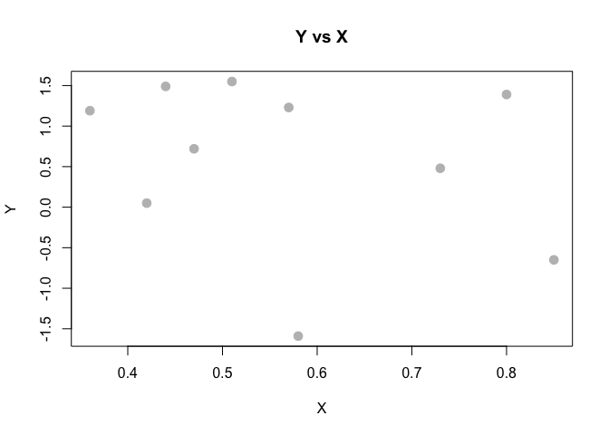
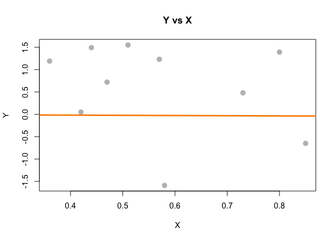
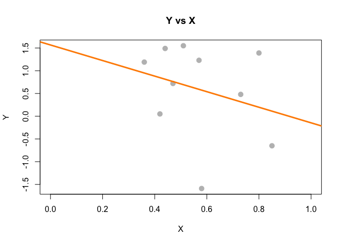

Homework 1
================

**1. Consider the data set given below**

x &lt;- c(0.18, -1.54, 0.42, 0.95)

And weights given by

w &lt;- c(2, 1, 3, 1)

**Give the value (a, b, c, or d) that minimizes the least squares equation **

**$\\sum\_{i=1}^N w\_i(x\_i - \\mu)^2$**

a: 0.1471

b: 0.300

c: 0.0025

d: 1.077

Hmmm...how do we figure this out? Well, one way would be to just plug in values.

``` r
#Let's just copy and paste in the R vectors from above.
x <- c(0.18, -1.54, 0.42, 0.95)
w <- c(2, 1, 3, 1)
#Create a vector of mu values
u <- c(0.1471,0.300,0.0025,1.077)

for(i in 1:4)
{
  newScore = sum(w*(x - u[i])^2)
  print(newScore)
}
```

    ## [1] 3.716543
    ## [1] 3.8801
    ## [1] 3.862994
    ## [1] 9.768983

**2. Consider the following data set**

x &lt;- c(0.8, 0.47, 0.51, 0.73, 0.36, 0.58, 0.57, 0.85, 0.44, 0.42)

y &lt;- c(1.39, 0.72, 1.55, 0.48, 1.19, -1.59, 1.23, -0.65, 1.49, 0.05)

Fit the regression through the origin and get the slope treating y as the outcome and x as the regressor.

a: 0.59915

b: -0.04462

c: -1.713

d: 0.8263

``` r
#here we try to explain y using x by estimating beta x, thus generating a line with slope beta x. Specifically in this case, we're going to force the line to go through the origin, (0,0). So force the line to go through (0,0). This is usually not a good solution unless we center our data. 
x <- c(0.8, 0.47, 0.51, 0.73, 0.36, 0.58, 0.57, 0.85, 0.44, 0.42)

y <- c(1.39, 0.72, 1.55, 0.48, 1.19, -1.59, 1.23, -0.65, 1.49, 0.05)

df = data.frame(x,y)

plot(y~x ,data = df,
     xlab = "X",
     ylab = "Y",
     main = "Y vs X",
     pch  = 20,
     cex  = 2,
     col  = "grey")
```



``` r
Sxy = sum((x - mean(x)) * (y - mean(y)))
Sxx = sum((x - mean(x)) ^ 2)
Syy = sum((y - mean(y)) ^ 2)
c(Sxy, Sxx, Syy)
```

    ## [1] -0.43508  0.25401  9.75164

``` r
beta_1_hat = Sxy / Sxx
beta_0_hat = mean(y) - beta_1_hat * mean(x)
c(beta_0_hat, beta_1_hat)
```

    ## [1]  1.567461 -1.712846

``` r
model <- lm(y~x - 1)
model
```

    ## 
    ## Call:
    ## lm(formula = y ~ x - 1)
    ## 
    ## Coefficients:
    ##      x  
    ## 0.8263

``` r
model <- lm(y~x + 1)
model
```

    ## 
    ## Call:
    ## lm(formula = y ~ x + 1)
    ## 
    ## Coefficients:
    ## (Intercept)            x  
    ##       1.567       -1.713

``` r
model <- lm(y~x)
model
```

    ## 
    ## Call:
    ## lm(formula = y ~ x)
    ## 
    ## Coefficients:
    ## (Intercept)            x  
    ##       1.567       -1.713

``` r
x_centered <- y-mean(y)
y_centered <- x-mean(x)
model <- lm(y_centered ~ x_centered)
model
```

    ## 
    ## Call:
    ## lm(formula = y_centered ~ x_centered)
    ## 
    ## Coefficients:
    ## (Intercept)   x_centered  
    ##   2.069e-17   -4.462e-02

``` r
plot(y~x,data = df,
     xlab = "X",
     ylab = "Y",
     main = "Y vs X",
     pch  = 20,
     cex  = 2,
     col  = "grey")
abline(model, lwd = 3, col = "darkorange")
```



1.  From the datasets package ‘mtcars’, fit the regression model with mpg as the outcome and weight (wt) and horsepower (hp) as the predictor. Use the matrix notation \[insert latex\] , give the slope coefficient and adjusted as R output

``` r
data("mtcars")
head(mtcars)
```

    ##                    mpg cyl disp  hp drat    wt  qsec vs am gear carb
    ## Mazda RX4         21.0   6  160 110 3.90 2.620 16.46  0  1    4    4
    ## Mazda RX4 Wag     21.0   6  160 110 3.90 2.875 17.02  0  1    4    4
    ## Datsun 710        22.8   4  108  93 3.85 2.320 18.61  1  1    4    1
    ## Hornet 4 Drive    21.4   6  258 110 3.08 3.215 19.44  1  0    3    1
    ## Hornet Sportabout 18.7   8  360 175 3.15 3.440 17.02  0  0    3    2
    ## Valiant           18.1   6  225 105 2.76 3.460 20.22  1  0    3    1

``` r
y <- mtcars$mpg
x1 <- mtcars$wt
x2 <- mtcars$hp

x0 <- rep(1,length(x1))
Y = as.matrix(y)
X = as.matrix(cbind(x0,x1,x2))
beta <- solve(t(X) %*% X) %*% (t(X) %*% Y)
beta
```

    ##           [,1]
    ## x0 37.22727012
    ## x1 -3.87783074
    ## x2 -0.03177295

``` r
Y_hat <- X %*% beta
SST   = sum((Y - mean(Y)) ^ 2)
SSReg = sum((Y_hat - mean(Y)) ^ 2)

R2 = SSReg/SST
R2
```

    ## [1] 0.8267855

``` r
# model <- lm(y~x1+x2)
# coef(model)
# summary(model)
```

1.  Consider the following data set (used above as well). x &lt;- c(0.8, 0.47, 0.51, 0.73, 0.36, 0.58, 0.57, 0.85, 0.44, 0.42) y &lt;- c(1.39, 0.72, 1.55, 0.48, 1.19, -1.59, 1.23, -0.65, 1.49, 0.05) What is the intercept for fitting the model with x as the predictor and y as the outcome?

``` r
x <- c(0.8, 0.47, 0.51, 0.73, 0.36, 0.58, 0.57, 0.85, 0.44, 0.42)
y <- c(1.39, 0.72, 1.55, 0.48, 1.19, -1.59, 1.23, -0.65, 1.49, 0.05)

model <- lm(y~x)
summary(model)
```

    ## 
    ## Call:
    ## lm(formula = y ~ x)
    ## 
    ## Residuals:
    ##     Min      1Q  Median      3Q     Max 
    ## -2.1640 -0.5818  0.2010  0.6669  1.1928 
    ## 
    ## Coefficients:
    ##             Estimate Std. Error t value Pr(>|t|)
    ## (Intercept)    1.567      1.252   1.252    0.246
    ## x             -1.713      2.105  -0.814    0.439
    ## 
    ## Residual standard error: 1.061 on 8 degrees of freedom
    ## Multiple R-squared:  0.07642,    Adjusted R-squared:  -0.03903 
    ## F-statistic: 0.662 on 1 and 8 DF,  p-value: 0.4394

1.  You know that both the predictor and response have mean 0. What can be said about the intercept when you fit a linear regression? a: It must be identically 0. b: It is undefined as you have to divide by zero.

``` r
#the constant (or Y intercept) will be the expected value of Y when predictor X is zero. The expected value of Y being the mean. 
y_zero <- y - mean(y)
x_zero <- x - mean(x)

model <- lm(y~x)
summary(model)
```

    ## 
    ## Call:
    ## lm(formula = y ~ x)
    ## 
    ## Residuals:
    ##     Min      1Q  Median      3Q     Max 
    ## -2.1640 -0.5818  0.2010  0.6669  1.1928 
    ## 
    ## Coefficients:
    ##             Estimate Std. Error t value Pr(>|t|)
    ## (Intercept)    1.567      1.252   1.252    0.246
    ## x             -1.713      2.105  -0.814    0.439
    ## 
    ## Residual standard error: 1.061 on 8 degrees of freedom
    ## Multiple R-squared:  0.07642,    Adjusted R-squared:  -0.03903 
    ## F-statistic: 0.662 on 1 and 8 DF,  p-value: 0.4394

``` r
plot(y~x,data = df,
     xlab = "X",
     ylab = "Y",
     main = "Y vs X",
     pch  = 20,
     cex  = 2,
     col  = "grey",
     xlim= c(0,1))
abline(model, lwd = 3, col = "darkorange")
```



1.  Consider the data given by x &lt;- c(0.8, 0.47, 0.51, 0.73, 0.36, 0.58, 0.57, 0.85, 0.44, 0.42) What value minimizes the sum of the squared distances between these points and itself? a: 0.36 b: 0.573 c: 0.8 d: 0.44

``` r
x <- c(0.8, 0.47, 0.51, 0.73, 0.36, 0.58, 0.57, 0.85, 0.44, 0.42)
# calculate the mean
print(mean(x))
```

    ## [1] 0.573

1.  Let the slope having fit Y as the outcome and X as the predictor be denoted as $\\sum\_{i=1}^N w\_i(x\_i - \\mu)^2$. Let the slope from fitting X as the outcome and Y as the predictor be denoted as . Suppose that you divide by ; in other words consider . What is this ratio always equal to? a: Cor(Y,X) b: Var(Y)/Var(X) c: 1 d: 2SD(Y)/SD(X)
